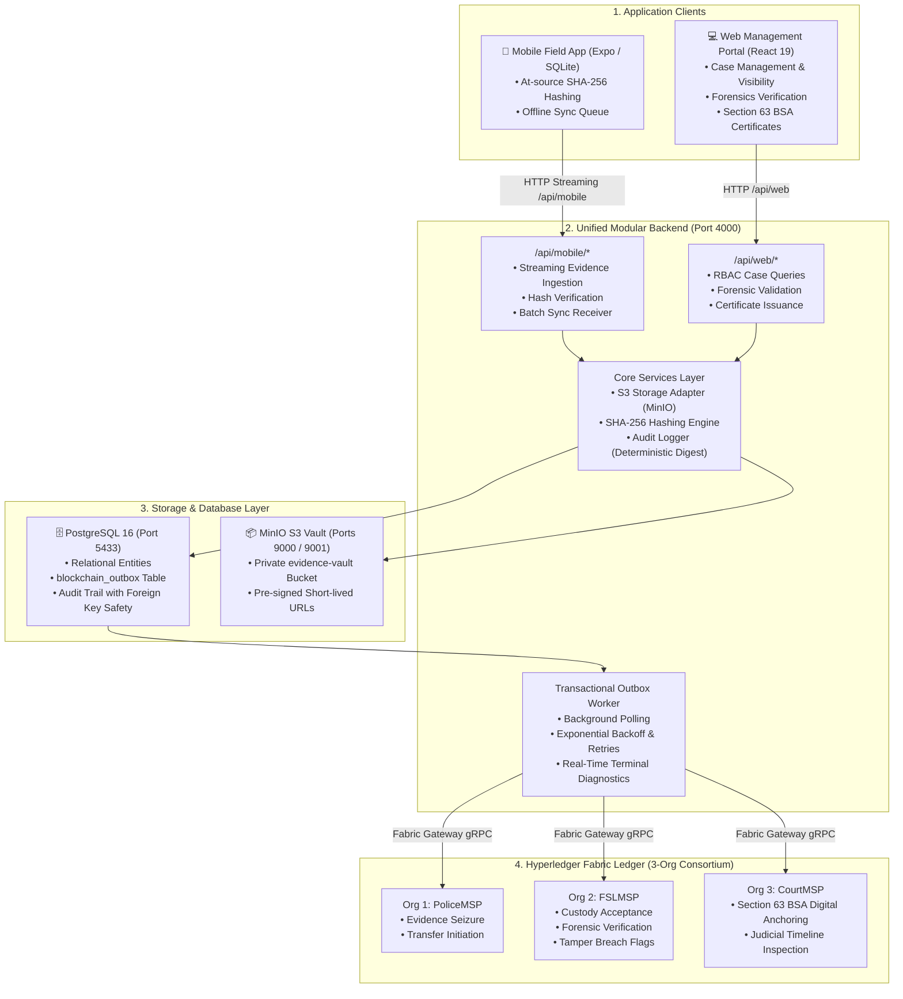

# Kaaval — Integrated Digital Evidence & Chain-of-Custody Platform

[](https://www.hyperledger.org/projects/fabric)
[](https://www.postgresql.org/)
[](https://min.io/)
[](https://nodejs.org/)
[](https://indiacode.nic.in/)

Kaaval is an enterprise digital evidence management, forensic integrity validation, and legal chain-of-custody platform engineered for **Law Enforcement (Police)**, **Forensic Science Laboratories (FSL)**, and the **Judiciary (Courts)** in compliance with **Section 63 of the Bharatiya Sakshya Adhiniyam (BSA), 2023**.

---

## 🏛️ System Architecture



---

## 🚀 Quick Start

### 1. Start Docker Infrastructure (PostgreSQL & MinIO)
```powershell
docker compose up -d
```

### 2. Start Unified Backend Server (Port 4000)
```powershell
cd backend
npm install
npm start
```

### 3. Start Web Management Portal (Port 5173)
```powershell
cd frontend_web
npm install
npm run dev
```

### 4. Start Mobile Field Application (Expo)
```powershell
cd frontend_mobile
npm install
npm start
```

### 5. Run Automated End-to-End Verification Suite
```powershell
cd backend
node test_e2e.js
```

---

## 📚 Technical Documentation

Comprehensive architectural and operational guides are available in [`docs/`](./docs):

* 🔗 [**Blockchain Architecture (`docs/BLOCKCHAIN_ARCHITECTURE.md`)**](./docs/BLOCKCHAIN_ARCHITECTURE.md) — 3-Organization Hyperledger Fabric consortium (`PoliceMSP`, `FSLMSP`, `CourtMSP`), append-only event ledger smart contract (`evidence.go`), composite key scans, and Section 63 BSA legal anchoring.
* ⚙️ [**Backend Architecture (`docs/BACKEND_ARCHITECTURE.md`)**](./docs/BACKEND_ARCHITECTURE.md) — Unified Modular Backend design, `/api/mobile` vs `/api/web` segregation, Transactional Outbox worker engine, MinIO S3 storage adapter, and terminal diagnostics.
* 🗄️ [**Database Schema (`docs/DATABASE_SCHEMA.md`)**](./docs/DATABASE_SCHEMA.md) — PostgreSQL 16 schema, custom ENUM types, outbox table, indexes, and foreign key integrity.
* 📱 [**Mobile Field App Guide (`docs/MOBILE_APP_GUIDE.md`)**](./docs/MOBILE_APP_GUIDE.md) — Offline-first SQLite storage, native `expo-crypto` SHA-256 hashing at capture, and sync worker.
* 💻 [**Web Portal Guide (`docs/WEB_PORTAL_GUIDE.md`)**](./docs/WEB_PORTAL_GUIDE.md) — React 19 / Vite management portal, role-based dashboards (Admin, Police, Forensics, Legal), and 5-second live polling sync.
* 🛠️ [**Deployment & Operational Runbook (`docs/DEPLOYMENT_AND_RUNBOOK.md`)**](./docs/DEPLOYMENT_AND_RUNBOOK.md) — Docker Compose setup, environment variable configuration, Hyperledger Fabric test network integration, and test credentials.