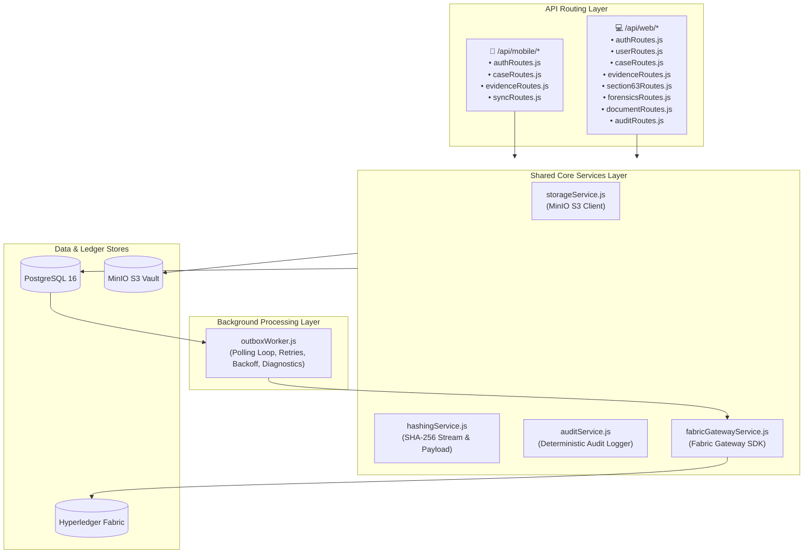
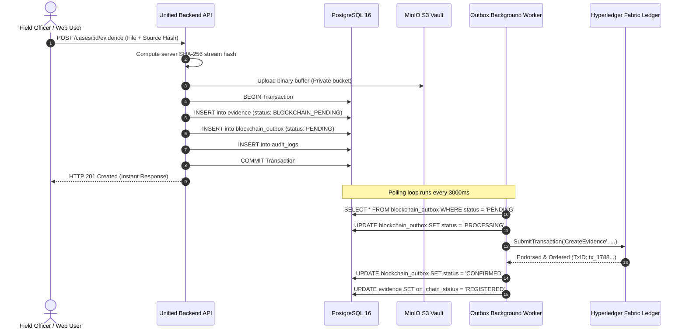

# Unified Modular Backend Architecture

> **Source Location:** [`backend/`](file:///d:/chain_of_custody/backend)  
> **Runtime:** Node.js (ESM Module), Express 4.21  
> **Default Port:** `4000`  
> **Database:** PostgreSQL 16 (Connection Pool, Port 5433)  
> **Object Storage:** MinIO S3 SDK (`evidence-vault` bucket, Port 9000)

---

## 1. Architectural Philosophy: Unified Modular Design

Kaaval adopts **Option 2 (Unified Modular Backend)**:
* Rather than maintaining two drifting backend repositories (`backend_mobile` and `backend_web`), a single Express server hosts segregated, domain-specific route trees sharing a hardened core persistence and security layer.

---

## 2. Route Directory & Endpoint Reference

### 📱 1. Mobile Field Domain (`/api/mobile/*`)
Tailored for bandwidth-constrained, offline-capable field police devices.

| Method | Endpoint | Description |
|---|---|---|
| `POST` | `/api/mobile/auth/login` | Officer login with badge and credentials, returns JWT. |
| `POST` | `/api/mobile/auth/logout` | Officer logout session teardown. |
| `GET` | `/api/mobile/cases` | Returns all active cases with embedded evidence array and pre-signed download URLs for local SQLite caching. |
| `GET` | `/api/mobile/cases/:id` | Detailed case record. |
| `POST` | `/api/mobile/cases` | On-scene case creation. |
| `POST` | `/api/mobile/cases/:id/evidence` | In-memory multipart streaming upload; validates source hash against server SHA-256 stream hash; uploads to MinIO; records in DB with `BLOCKCHAIN_PENDING`; creates outbox event. |
| `POST` | `/api/mobile/cases/:cId/evidence/:eId/verify` | Re-evaluates file existence in MinIO and verifies integrity hash. |
| `POST` | `/api/mobile/sync/push` | Batch synchronization endpoint receiving offline SQLite mutation queues. |

### 💻 2. Web Management Domain (`/api/web/*`)
Tailored for station administrators, forensic analysts, and judicial officers.

| Method | Endpoint | Description |
|---|---|---|
| `POST` | `/api/web/auth/login` | Multi-role web authentication (Admin, Police, Forensics, Legal). |
| `GET` | `/api/web/users` | List users with designations and badge numbers. |
| `PATCH` | `/api/web/users/:id` | Update officer profile and designations. |
| `GET` | `/api/web/cases` | Filtered case search with relational custodian and forensics details. |
| `POST` | `/api/web/cases` | Station case registration. |
| `PATCH` | `/api/web/cases/:id/status` | Case status state transition (e.g. `UNDER_INVESTIGATION`). |
| `POST` | `/api/web/cases/:id/transfer-custody` | Inter-officer custody handover; logs transfer and enqueues `TRANSFER_INITIATE` to outbox. |
| `GET` | `/api/web/evidence` | Filtered evidence list with pre-signed download URLs and RBAC visibility rules. |
| `POST` | `/api/web/evidence` | Manual or lab evidence registration. |
| `PATCH` | `/api/web/evidence/:id/visibility` | Configure granular role/designation access control rules. |
| `PATCH` | `/api/web/evidence/:id/approve` | Legal approval verification (requires Primary or Section 63 certificate). |
| `POST` | `/api/web/evidence/:id/section63` | Issues BSA Section 63 digital certificate; enqueues `COURT_SUBMIT` to outbox. |
| `POST` | `/api/web/forensics/verify` | Independent forensic laboratory SHA-256 verification; enqueues `FORENSIC_VERIFY` or `INTEGRITY_FLAG`. |
| `GET` | `/api/web/documents` | Retrieve legal documents (FIRs, charge sheets, forensic reports). |
| `POST` | `/api/web/documents` | Upload new legal document. |
| `GET` | `/api/web/audit/logs` | Query immutable tamper-evident system audit logs. |

---

## 3. Transactional Outbox Engine

Direct synchronous blockchain submissions during user HTTP requests introduce unacceptable latency (2–5 seconds per consensus round) and catastrophic availability failures when peer nodes undergo maintenance.

Kaaval utilizes the **Transactional Outbox Pattern**:

### Outbox Error Diagnostics & Polling:
* **Exponential Backoff:** Retries failed submissions up to `OUTBOX_MAX_RETRIES` (default: 5).
* **Terminal Diagnostics:** Automatically diagnoses root causes (`FABRIC_PEER_OFFLINE`, `WALLET_IDENTITY_MISSING`, `CHAINCODE_ENDORSEMENT_FAILED`) and prints human-readable explanations to the terminal.

---

## 4. MinIO S3 Storage Adapter

* Evidence files are stored in an isolated, non-public MinIO bucket (`evidence-vault`).
* Files are accessed exclusively through short-lived, cryptographically signed pre-signed URLs (`presignedUrlExpiry = 900` seconds / 15 minutes).
* Object keys follow deterministic hierarchical paths: `cases/${caseId}/${evidenceId}.${ext}`.

---

## 5. Cryptographic Hashing Service

* **`computeBufferHash(buffer)`:** Computes standard `SHA-256` hexadecimal digest.
* **`hashMetadata(payload)`:** Normalizes JSON object keys in alphabetical order before hashing, ensuring identical payloads yield identical hashes across platforms regardless of key insertion order.
* **`compareHashes(hashA, hashB)`:** Performs case-insensitive, sanitized comparison.
