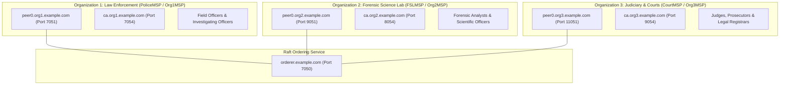
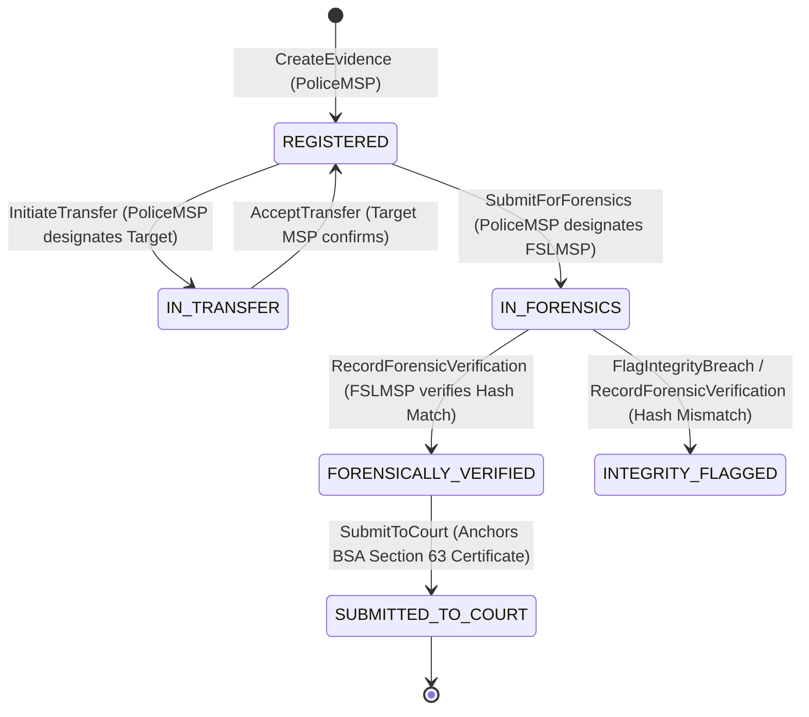

# Hyperledger Fabric Blockchain Architecture

> **Chaincode Source:** [`chaincode/evidence/go/evidence.go`](file:///d:/chain_of_custody/chaincode/evidence/go/evidence.go)  
> **Target Network:** Hyperledger Fabric 2.5 (Channel: `mychannel` / `kaaval-evidence-channel`)  
> **Consortium:** 3 Organizations (`PoliceMSP`, `FSLMSP`, `CourtMSP`)  
> **State Database:** LevelDB with Prefix Composite Keys

---

## 1. Consortium Topology & MSP Roles

Kaaval's blockchain network is partitioned across three independent Member Service Providers (MSPs) corresponding to legal jurisdictions:



### MSP Role Responsibilities:

| Organization | MSP ID | Key Responsibilities | Allowed Chaincode Invocations |
|---|---|---|---|
| **Law Enforcement** | `PoliceMSP` (`Org1MSP`) | First responder evidence seizure, scene photography, physical custody tracking. | `CreateEvidence`, `InitiateTransfer`, `SubmitForForensics`, `SubmitToCourt` |
| **Forensic Laboratory** | `FSLMSP` (`Org2MSP`) | Scientific extraction, bit-stream imaging, independent SHA-256 validation, tamper breach alerting. | `AcceptTransfer`, `RecordForensicVerification`, `FlagIntegrityBreach` |
| **Judiciary / Courts** | `CourtMSP` (`Org3MSP`) | Evidentiary trial admission, Section 63 BSA certificate anchoring, forensic audit timeline inspection. | `SubmitToCourt`, `GetEvidenceHistory`, `GetEvidenceEvents` |

---

## 2. Smart Contract Data Model

The Go smart contract implements an **Append-Only Event Ledger** pattern. Instead of mutating history in place, every lifecycle transition appends a discrete, cryptographically signed `CustodyEvent` into the world state using composite keys.

### 1. Evidence Asset (Current World State)
```go
type EvidenceAsset struct {
    EvidenceID        string `json:"evidenceId"`        // Primary UUID/Identifier
    CaseID            string `json:"caseId"`            // Parent Case Number
    SourceHash        string `json:"sourceHash"`        // SHA-256 calculated on mobile device at capture
    ServerHash        string `json:"serverHash"`        // SHA-256 verified by server upon ingestion
    MetadataHash      string `json:"metadataHash"`      // SHA-256 of canonical metadata payload
    OwnerMSP          string `json:"ownerMSP"`          // Current custodian MSP (e.g. PoliceMSP)
    TransferTargetMSP string `json:"transferTargetMSP"` // Designated target MSP during 2-step handshakes
    Status            string `json:"status"`            // REGISTERED, IN_TRANSFER, IN_FORENSICS, FORENSICALLY_VERIFIED, INTEGRITY_FLAGGED, SUBMITTED_TO_COURT
    RiskLevel         string `json:"riskLevel"`         // LOW, MEDIUM, HIGH, CRITICAL
    Section63Ref      string `json:"section63Ref"`      // Legal BSA Section 63 Digital Certificate Reference
    CreatedTimestamp  string `json:"createdTimestamp"`  // RFC3339 timestamp
    LastUpdated       string `json:"lastUpdated"`       // RFC3339 timestamp
    TxID              string `json:"txId"`              // Blockchain Transaction ID
}
```

### 2. Custody Event (Immutable Append-Only Audit Entry)
```go
type CustodyEvent struct {
    EventID     string `json:"eventId"`     // Unique EVENT_<evidenceId>_<timestamp>
    EvidenceID  string `json:"evidenceId"`  // Reference to Asset
    EventType   string `json:"eventType"`   // CREATED, TRANSFER_INITIATED, TRANSFER_ACCEPTED, FORENSIC_SUBMITTED, FORENSIC_VERIFIED, INTEGRITY_BREACH, COURT_SUBMITTED
    FromMSP     string `json:"fromMSP"`     // Relinquishing MSP
    ToMSP       string `json:"toMSP"`       // Receiving MSP
    ActingMSP   string `json:"actingMSP"`   // MSP executing the transaction (caller)
    ActorID     string `json:"actorId"`     // Human officer/analyst ID
    ActorRole   string `json:"actorRole"`   // POLICE, FORENSICS, LEGAL, ADMIN
    Timestamp   string `json:"timestamp"`   // Transaction commit timestamp
    TxID        string `json:"txId"`        // Fabric transaction ID
    PayloadHash string `json:"payloadHash"` // Contextual payload hash (e.g. verified hash)
    Notes       string `json:"notes"`       // Context notes or reason
}
```

---

## 3. Key Lifecycle Transactions



### Transaction Reference:

1. **`CreateEvidence(evidenceId, caseId, sourceHash, serverHash, metadataHash, riskLevel, actorId, actorRole)`**
   * Authenticates caller MSP (`clientMSP`).
   * Validates non-existence (`EvidenceExists`).
   * Creates `EvidenceAsset` with `Status = 'REGISTERED'` and `OwnerMSP = clientMSP`.
   * Emits `CREATED` event.

2. **`InitiateTransfer(evidenceId, targetMSP, actorId, actorRole, notes)`**
   * Step 1 of 2-step custody transfer handshake.
   * Ensures only current `OwnerMSP` can initiate transfer.
   * Sets `Status = 'IN_TRANSFER'` and `TransferTargetMSP = targetMSP`.

3. **`AcceptTransfer(evidenceId, actorId, actorRole, notes)`**
   * Step 2 of 2-step custody transfer handshake.
   * Validates caller's MSP matches `TransferTargetMSP`.
   * Transfers ownership: `OwnerMSP = clientMSP`, clears `TransferTargetMSP`, sets `Status = 'REGISTERED'`.

4. **`SubmitForForensics(evidenceId, fslMSP, actorId, actorRole, notes)`**
   * Transitions custody to Forensic Lab. Sets `TransferTargetMSP = fslMSP`, `Status = 'IN_FORENSICS'`.

5. **`RecordForensicVerification(evidenceId, verifiedHash, resultStatus, actorId, actorRole, notes)`**
   * Invoked by `FSLMSP` analyst.
   * Compares `verifiedHash` against registered `SourceHash`.
   * If match: updates `Status = 'FORENSICALLY_VERIFIED'`.
   * If mismatch: mutates state to `INTEGRITY_FLAGGED`.

6. **`FlagIntegrityBreach(evidenceId, detectedHash, reason, actorId, actorRole)`**
   * Immediately flags tampering on the ledger, records breach event with cryptographic timestamp.

7. **`SubmitToCourt(evidenceId, courtMSP, section63Ref, actorId, actorRole, notes)`**
   * Attaches Bharatiya Sakshya Adhiniyam Section 63 Digital Certificate reference.
   * Transitions asset to `SUBMITTED_TO_COURT` for courtroom trial inspection.

8. **`GetEvidenceEvents(evidenceId)` & `GetEvidenceHistory(evidenceId)`**
   * Evaluates prefix scan `GetStateByRange("EVENT_<evidenceId>_", "EVENT_<evidenceId>_\uffff")` to retrieve complete immutable timeline without CouchDB index overhead.

---

## 4. Legal Anchoring: Bharatiya Sakshya Adhiniyam (BSA), 2023

Under **Section 63 of BSA, 2023** (formerly Section 65B of Indian Evidence Act), electronic records are admissible only if their integrity, custody chain, and production conditions are certified.

Kaaval anchors this requirement directly on-chain:
1. **Source Hash Capture:** Mobile field app computes SHA-256 hash before transmission.
2. **Server Verification:** Ingestion layer validates stream hash against source hash.
3. **Forensic Re-computation:** FSL lab records independent SHA-256 validation on the ledger.
4. **Section 63 Certificate Reference:** Certificate UUID is immutably committed alongside the certifying officer's cryptographic identity, providing indisputable non-repudiation in court.
