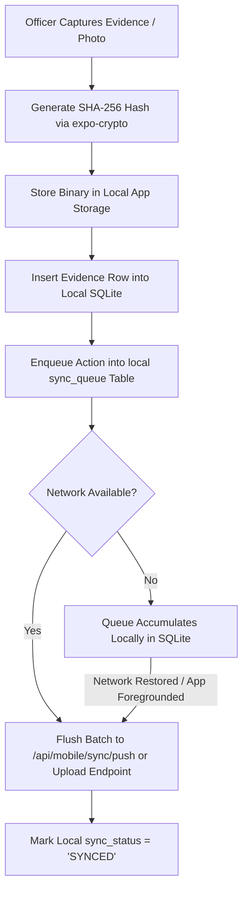

# Mobile Field App Architecture & Guide

> **Source Location:** [`frontend_mobile/`](file:///d:/chain_of_custody/frontend_mobile)  
> **Framework:** React Native / Expo (SDK 52), TypeScript  
> **Persistence:** Local SQLite with AES-CBC Field Encryption  
> **Backend Base URL:** `http://<host>:4000` (Unified Backend)

---

## 1. Offline-First Mobile Design

Field officers collecting evidence at crime scenes often operate in environments with poor or nonexistent cellular connectivity. Kaaval's mobile app is engineered on an **offline-first paradigm**:



---

## 2. At-Capture Cryptographic Hashing

To guarantee digital evidence integrity from the exact moment of physical seizure:
1. When a photo, video, or file is selected in [`EvidenceScreen.tsx`](file:///d:/chain_of_custody/frontend_mobile/src/screens/EvidenceScreen.tsx), the raw binary content is read directly from cache storage.
2. The native hardware crypto engine [`expo-crypto`](file:///d:/chain_of_custody/frontend_mobile/src/screens/EvidenceScreen.tsx) computes the true `SHA-256` hash:
   ```typescript
   const fileContent = await FileSystem.readAsStringAsync(tempUri, { 
     encoding: FileSystem.EncodingType.Base64 
   });
   const sourceHash = await Crypto.digestStringAsync(
     Crypto.CryptoDigestAlgorithm.SHA256, 
     fileContent
   );
   ```
3. The `sourceHash` is permanently bound to the evidence metadata before transmission.
4. When uploaded, the backend verifies that the streamed file's server-computed SHA-256 matches the `sourceHash`. If any bytes were altered in transit, the evidence is immediately flagged.

---

## 3. Local Database & AES-CBC Field Encryption

The mobile app maintains an embedded SQLite database ([`src/db/`](file:///d:/chain_of_custody/frontend_mobile/src/db)):

* **`local_cases`**: Cached case metadata for instant zero-latency dashboard rendering.
* **`local_evidence`**: Evidence catalog with local file URIs, remote URLs, hashes, and sync statuses (`PENDING_UPLOAD`, `SYNCED`, `FAILED`).
* **`sync_queue`**: Append-only queue of mutations to push upstream.
* **Hardware Key Security ([`encryption.ts`](file:///d:/chain_of_custody/frontend_mobile/src/db/encryption.ts)):** Sensitive notes and witness statements are encrypted using 256-bit AES-CBC with a hardware-backed key stored in `Expo SecureStore` (Keystore on Android, Keychain on iOS).

---

## 4. Sync Queue Worker ([`src/db/sync.ts`](file:///d:/chain_of_custody/frontend_mobile/src/db/sync.ts))

The background sync worker executes on three triggers:
1. **App Foregrounding:** Listens to `AppState` transitions from `background` $\rightarrow$ `active`.
2. **Network Reconnection:** Listens to `@react-native-community/netinfo` connectivity events.
3. **Post-Mutation Dispatch:** Proactively attempts upload immediately after saving locally.

### Synchronization Request Payload:
```json
{
  "mutations": [
    {
      "queueId": 12,
      "entityType": "CASE",
      "entityId": "CASE-2026-081",
      "actionType": "CREATE",
      "payload": {
        "title": "Scene Seizure 81",
        "location": "Anna Nagar, Chennai",
        "officer": "S. Murugan"
      }
    }
  ]
}
```

---

## 5. Running the Mobile App

```powershell
cd frontend_mobile
npm install
npm start
```
* Press `a` to open in Android Emulator / Device.
* Press `w` to open in Web Browser.
* Scan the QR code using Expo Go on a physical device connected to the same Wi-Fi network.
