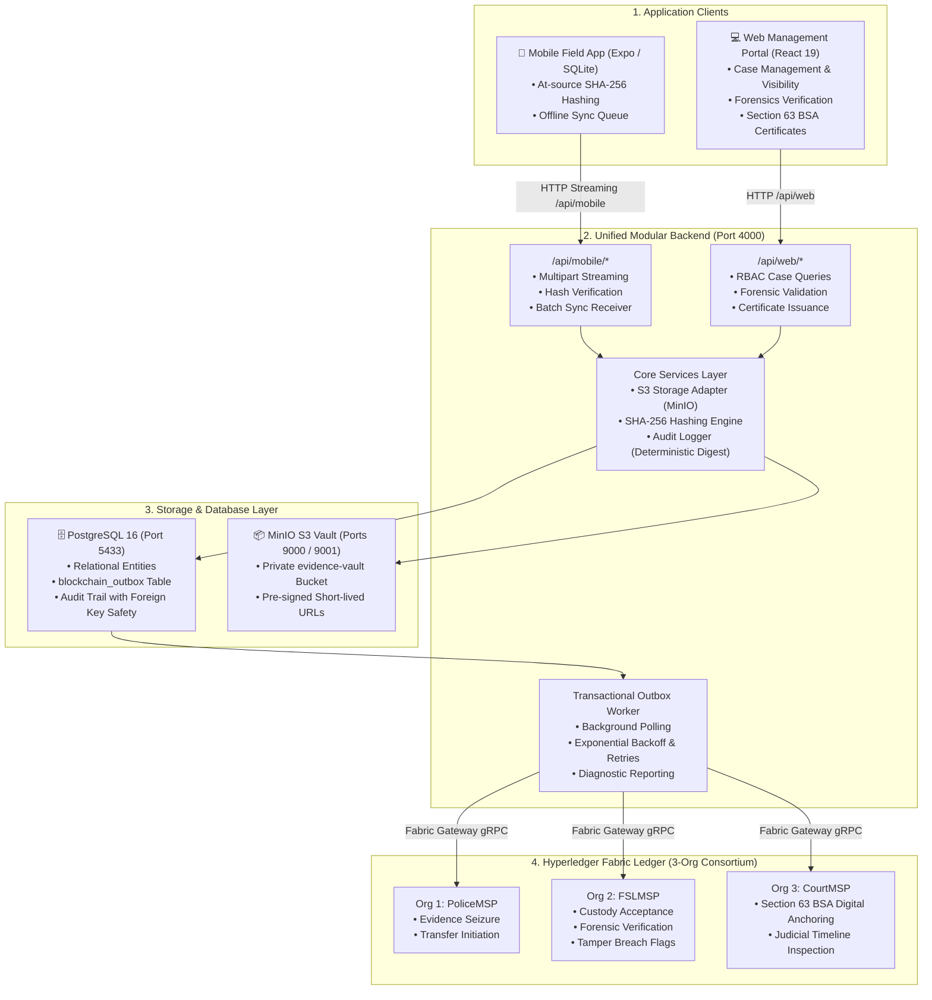

# Kaaval — Integrated Digital Evidence & Chain-of-Custody Platform
## Technical Architecture & Documentation Index

> **Version:** 2.0.0 (Unified Enterprise Architecture)  
> **Blockchain Platform:** Hyperledger Fabric 2.5 (3-Organization Consortium: Police, Forensics, Judiciary)  
> **Database:** PostgreSQL 16 (Relational & Outbox Store)  
> **Storage:** MinIO / Private S3 Object Storage  
> **Backend:** Node.js (ESM), Express, Fabric Gateway SDK, AWS S3 SDK  
> **Clients:** React 19 Web Portal (Vite + Tailwind) & React Native Field App (Expo + SQLite)

---

## 1. System Overview

**Kaaval** is an enterprise-grade digital evidence management, forensic integrity validation, and legal chain-of-custody platform designed for law enforcement, forensic laboratories, and judicial bodies in compliance with the **Bharatiya Sakshya Adhiniyam (BSA), 2023** (Section 63 Digital Evidence Admissibility).



---

## 2. Documentation Directory

Detailed technical design documents are organized into the following modules:

| Document | Description |
|---|---|
| [**`BLOCKCHAIN_ARCHITECTURE.md`**](./BLOCKCHAIN_ARCHITECTURE.md) | 3-Organization consortium topology, Smart Contract (`evidence.go`) append-only event ledger pattern, LevelDB composite keys, and Section 63 BSA legal anchoring. |
| [**`BACKEND_ARCHITECTURE.md`**](./BACKEND_ARCHITECTURE.md) | Unified modular backend design, `/api/mobile` vs `/api/web` route segregation, Transactional Outbox worker engine, MinIO S3 adapter, and terminal diagnostics. |
| [**`DATABASE_SCHEMA.md`**](./DATABASE_SCHEMA.md) | Complete PostgreSQL 16 relational data model, custom ENUM types, outbox table, indexes, and foreign key integrity. |
| [**`MOBILE_APP_GUIDE.md`**](./MOBILE_APP_GUIDE.md) | Offline-first mobile field architecture, hardware-backed `expo-crypto` SHA-256 hashing at capture, and sync worker. |
| [**`WEB_PORTAL_GUIDE.md`**](./WEB_PORTAL_GUIDE.md) | React 19 / Vite web portal, multi-role dashboard workflows (Admin, Police, Forensics, Court), and 5-second live polling sync. |
| [**`DEPLOYMENT_AND_RUNBOOK.md`**](./DEPLOYMENT_AND_RUNBOOK.md) | Docker Compose provisioning, environment variables setup, Hyperledger Fabric test-network integration, and verification test suite. |

---

## 3. Quick Start

### Step 1: Start Containerized Infrastructure
```powershell
docker compose up -d
```

### Step 2: Start Backend Server
```powershell
cd backend
npm start
# Server listens on http://localhost:4000
```

### Step 3: Start Web Management Portal
```powershell
cd frontend_web
npm run dev
# Web portal runs on http://localhost:5173
```

### Step 4: Run Integration Test Suite
```powershell
cd backend
node test_e2e.js
```
