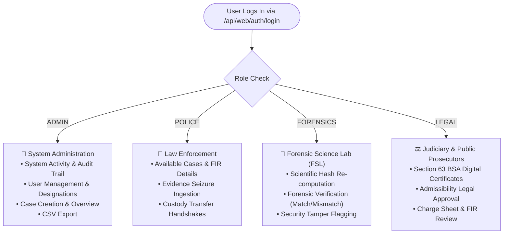

# Web Management Portal Architecture & User Guide

> **Source Location:** [`frontend_web/`](file:///d:/chain_of_custody/frontend_web)  
> **Framework:** React 19, Vite, TypeScript, Tailwind CSS, Lucide Icons  
> **Default Port:** `3000` / `5173`  
> **Target Backend:** `http://localhost:4000` (Unified Backend)

---

## 1. User Roles & Permission Matrices

The web portal renders specialized interfaces tailored to the authenticated user's judicial role:



---

## 2. Key Modules & Functional Workflows

### 1. Evidence Vault ([`components/EvidenceVault.tsx`](file:///d:/chain_of_custody/frontend_web/components/EvidenceVault.tsx))
* **Primary vs Secondary Evidence:** Automatically classifies evidence based on whether at-source hash and continuous lifting video are present (BSA 2023 compliance).
* **Pre-Signed Secure Preview:** Retrieves temporary 15-minute URLs from MinIO without exposing raw storage credentials.
* **Granular RBAC Visibility Controls:** Restrict evidence access to designated roles, designations, or specific officer user IDs.

### 2. Forensics Lab & Verification ([`components/Dashboards.tsx`](file:///d:/chain_of_custody/frontend_web/components/Dashboards.tsx))
* Analysts perform independent bit-stream SHA-256 verification.
* Clicking **Verify** dispatches `POST /api/web/forensics/verify`.
* If matching: commits `FORENSIC_VERIFY` on-chain and marks status `VERIFIED`.
* If mismatch: mutates state to `COMPROMISED` and triggers `INTEGRITY_FLAG` security alerts across all station dashboards.

### 3. BSA Section 63 Digital Certificates ([`components/CertificateManager.tsx`](file:///d:/chain_of_custody/frontend_web/components/CertificateManager.tsx))
* Formats statutory digital evidence certificates certifying:
  * Certifying Officer designation & badge.
  * SHA-256 hash algorithm & verified digest.
  * Hardware/device production parameters.
* Attaches the certificate reference directly to the Hyperledger Fabric ledger (`SubmitToCourt`).

### 4. Chain of Custody Timeline ([`components/ChainOfCustody.tsx`](file:///d:/chain_of_custody/frontend_web/components/ChainOfCustody.tsx))
* Visualizes the complete custody trajectory from initial seizure $\rightarrow$ transit $\rightarrow$ FSL lab analysis $\rightarrow$ judicial courtroom presentation.

---

## 3. Real-Time Background Synchronization

In [`frontend_web/store.tsx`](file:///d:/chain_of_custody/frontend_web/store.tsx):
* **Automatic Live Polling:** Executes `loadData()` every 5 seconds.
* **Instant Collaboration:** New cases created in the field or evidence uploaded by forensic analysts appear automatically across station browsers without requiring page reloads.
* **Session Persistence:** Authenticated session is stored in `localStorage` (`kaaval_user`), ensuring active work is not disrupted by browser tab switches.

---

## 4. Running and Building the Web Portal

```powershell
# Development server (runs on http://localhost:5173)
cd frontend_web
npm install
npm run dev

# Production Build
npm run build
```
